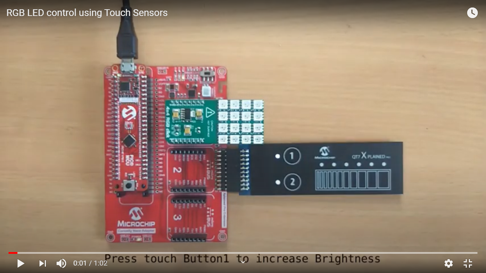
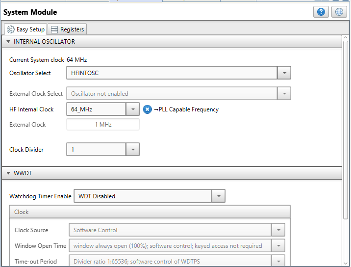

<!-- Please do not change this html logo with link -->

## RGB LED Control using Capacitive Touch Sensors

## Introduction
  
The PIC18-Q10 family of devices have advanced ADCC module, which supports hardware CVD feature for seamless integration of capacitive touch sensing capability to the applications.

This demo illustrates usage of ADC with computation (ADCC) and capacitive voltage division (CVD) modules present in PIC18-Q10 family of MCUs, to control a 4x4 RGB LED click board using Microchip’s Curiosity Nano Base click board and QT7 Xplained Pro extension kit.

#### To see the RGB LED  Control using Touch Sensors demo operation video, click on the below image.

 

## Useful Links

- [PIC18F47Q10 Product Page](https://www.microchip.com/wwwproducts/en/PIC18F47Q10 "PIC18F47Q10 Product Page")
- [PIC18F47Q10 Code Examples on GitHub](https://github.com/microchip-pic-avr-examples?q=PIC18F47Q10&type=&language= "PIC18F47Q10 Code Examples on GitHub")
- [mTouch® Capacitive Sensing Library Module for Mplab® X Code Configurator User’s Guide.](http://ww1.microchip.com/downloads/en/DeviceDoc/40001852A.pdf "mTouch® Capacitive Sensing Library Module for Mplab® X Code Configurator User’s Guide.")

## Description

In this demo,

* PIC18F47Q10 (40-pin) MCU is used to demonstrate peripheral features of the PIC18-Q10 family of MCUs.
* The Microchip Curiosity Nano Base for Click boards™ evaluation kit is a hardware extension platform to ease the connection between Curiosity Nano kits and extension boards like the mikroBUS Click modules and Xplained Pro extension boards.
* The QT7 Xplained PRO extension kit is used as it has got two touch buttons and a slider to detect the touch events to control 4x4 RGB click. The library support for touch is present in MCC (Microchip Code Configurator), which is intuitive and can be configured in few clicks.

The MCC library for PIC18F47Q10 MCU provides support for touch buttons and proximity sensors. The two buttons present on QT7 Xplained kit are configured to control the brightness and change the colors of RGB click. The buttons on QT7 has feedback LEDs to indicate the button press event, which can be controlled by the microcontroller.

## Software  Tools

* MPLAB® X IDE [v5.40.0 or newer](https://www.microchip.com/mplab/mplab-x-ide)
* XC8 Compiler [v2.30.0 or newer](https://www.microchip.com/mplab/compilers)
* Microchip PIC18F-Q Series Device Support Pack [v1.8.154 or newer](https://packs.download.microchip.com/#collapse-Microchip-PIC18F-Q-DFP-pdsc)
* Microchip Code Configurator [v4.0.1 or newer](https://www.microchip.com/mplab/mplab-code-configurator)
* mTouch Capacitive Sensing Library [v2.90.0]( https://www.microchip.com/mplab/mplab-code-configurator "mTouch Capacitive Sensing Library v2.90.0")

***Note: For running the demo, the installed tool versions should be the same or later. This example is not tested with the previous versions.***

## Hardware used

* [PIC18F47Q10 Curiosity Nano](https://www.microchip.com/Developmenttools/ProductDetails/DM182029 "PIC18F47Q10 Curiosity Nano")
* [4x4 RGB click](https://www.mikroe.com/4x4-rgb-click "4x4 RGB click")
* [QT7 Xplained Pro Extension Board](https://www.microchip.com/developmenttools/ProductDetails/atqt7-xpro "QT7 Xplained Pro Extension Board")
* [Curiosity Nano Base for Click boards](https://www.microchip.com/developmenttools/ProductDetails/AC164162 "Curiosity Nano Base for Click boards")

## Hardware connections

The following connections should be done between the PIC18F47Q10 Curiosity Nano board and QT7 Xplained PRO extension kit. Plugin the 4x4 RGB click in mikroBUS slot1 of the curiosity nano base click board.

|QT7 Xplained Pro | PIC18F47Q10 Curiosity Nano| 
|:---------:|:----------:|
| PIN4   - Y-LINE-1 |  RA2 |
| PIN6   - LED6     |  RD5 |
| PIN10  - Y-LINE-0 |  RD7 |
| PIN11  - LED7     |  RB2 |
| PIN19  - GND      |  GND |
| PIN20  - VCC      |  VDD |

  

## MCC settings

This section shows the settings used in the demo/example for various MCU modules configuration. These settings were done using the Microchip Code Configurator (MCC). Open MCC to look at the settings of the modules.

### System module settings:

In “Registers” view, RSTOSC is configured as HFINTOSC with HFFRQ = 64 MHz and CDIV = 1:1

  

### Pin manager settings:

Selected pins RA2 and RD7 as touch buttons, pins RD5 and RB2 to drive the feedback LEDs of touch buttons and RA7 to control RGB click.

  

Customized the names of I/O pins as below. Configured the pins RD5 and RB2 as output and renamed them as LED1 and LED2 respectively. Also, configured RA7 as output and renamed the pin as RGBLED.

  

## mTouch settings:

### Hardware sensors:

  

### Buttons:

  

### Sensor settings:

  

### Button Settings:

  

## Timer 1 settings:

  

## Timer 3 settings:

  

## Operation

1. After making the above hardware connections, power on the board with micro USB cable.

2. Build demo firmware and load the generated hex file onto the PIC18F47Q10 MCU. When the demo firmware is loaded, red LEDs are turned on with lowest brightness.

  

3. Pressing touch button 1 will increase the brightness.

  

4. Pressing touch button 2 will decrease the brightness.

  

5. When both the buttons are pressed together the color will change.

  

6. The state of buttons (i.e. finger touch/release event) can be visualized through the feedback LEDs present on the QT7 xplained pro kit.

7. The brightness levels can be adjusted by changing the macro values in the RGB4x4Click.h header file.

  

**Note:**

1. *Two timers are used to detect the duration of button press to handle various operations.*
2. *If the buttons are pressed and released within 3 seconds , the necessary actions are taken (i.e. brightness control and color change).*
3. *If the buttons are pressed for more than 3 seconds, it will be detected as fault condition and no action will be taken.*
4. *This time out can be configured from 1 sec to 3 secs in the firmware using appropriate macro.*
5. *Don’t drive the LEDs to maximum brightness. Because it will generate excessive heat and draw more current than advisable (up to 0.7A), which could potentially damage the main board.*
6. *Do not touch the board when it is in use.*

## Conclusion

This example shows how easy it is to enable capacitive touch interface by configuring ADCC and CVD modules of PIC18-Q10 family of MCUs through MCC wizard. Also, demonstrates usage of capacitive touch interface of PIC18-Q10 family of MCUs for command and control applications.

